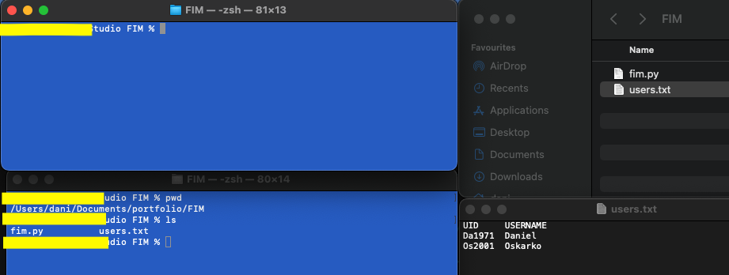
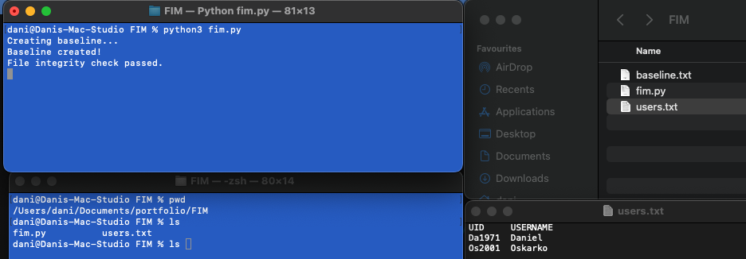
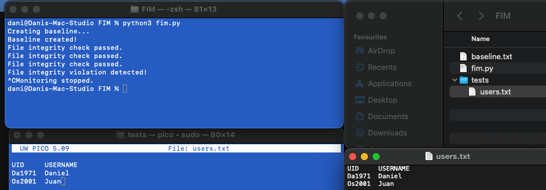

# fim (File Integrity Monitoring)

## Description:
A simple example of a File Integrity Monitoring script

## What is FIM?

File Integrity Monitoring (FIM) is a crucial cybersecurity technique used to detect unauthorized or malicious changes made to files and system configurations on a computer or network. Its primary purpose is to maintain the integrity and security of critical files and directories by continuously monitoring and analyzing them for any alterations or anomalies.

The basic idea behind File Integrity Monitoring is to compare the current state of files and configurations with their known, secure baseline. This baseline typically includes cryptographic hash values (e.g., MD5, SHA-256) or file attributes that represent the expected and authorized state of each file. These hash values act as fingerprints for the files, enabling FIM systems to detect any changes, additions, or deletions.

## How it works?

Here's how File Integrity Monitoring works:

1) Baseline Creation: Initially, a baseline snapshot of all relevant files and configurations is taken when the system is in a known good state. This baseline is stored securely and used as a reference point for future comparisons.

2) Real-time Monitoring: After establishing the baseline, the FIM system continuously monitors the files and directories for any changes. This monitoring can occur at various intervals, depending on the organization's requirements and the sensitivity of the data.

3) Integrity Checks: The FIM system compares the current state of files and configurations with the baseline using the cryptographic hash values or other attributes. If any discrepancy is found, it indicates a potential security breach or unauthorized modification.

4) Alerting and Reporting: When a change is detected, the FIM system generates an alert or notification to the system administrator or security team. The alert includes information about the modified file, the nature of the change, and its timestamp.

5) Incident Response: Upon receiving an alert, the security team investigates the detected change to determine whether it is legitimate or the result of a security incident. In case of a security breach or unauthorized access, appropriate actions are taken to mitigate the impact and prevent further compromise.

## Why is it important?

File Integrity Monitoring is essential for several reasons:

- Detecting Malware: FIM can detect the presence of malware or unauthorized software installations that might compromise system security.

- Identifying Insider Threats: It helps in identifying unauthorized access or data manipulation by employees or internal users with malicious intent.

- Compliance Requirements: Many regulatory standards and frameworks mandate the use of FIM to ensure data integrity and security. Examples include PCI DSS, HIPAA, and GDPR.

- Early Detection of Attacks: FIM can detect cyberattacks like ransomware attempts, where files are encrypted or altered without authorization.


By employing File Integrity Monitoring, organizations can enhance their security posture and proactively address potential security breaches, minimizing the risk of data tampering and unauthorized access.

## What does my script do?

As this is a very basic script it has a simple monitoring function. Once launched it checks every 15 seconds if any chnages have been done on the "users.txt" file.

## Script explanation

First let's import the needed libraries:  
```
import hashlib
import os
import time
```
Then it defines the function to calculate the Hash:
```
def calculate_hash(file_path):
    # Calculate the SHA-256 hash of a file
    sha256_hash = hashlib.sha256()
    with open(file_path, "rb") as file:
        # Read the file in chunks to support large files
        while chunk := file.read(4096):
            sha256_hash.update(chunk)
    return sha256_hash.hexdigest()
```
Afterwards it defines the function to create the baseline (It calculates the SHA-256 hash of the file using the calculate_hash function and stores the hash value in the baseline file.):
```
def create_baseline(file_path, baseline_file):
    # Calculate the baseline hash value and store it in a baseline file
    baseline_hash = calculate_hash(file_path)
    with open(baseline_file, "w") as f:
        f.write(baseline_hash)
```
Then it defines the function in charge for the integrity check:
```
def check_integrity(file_path, baseline_file):
    # Compare the current hash value with the baseline hash value
    current_hash = calculate_hash(file_path)
    with open(baseline_file, "r") as f:
        baseline_hash = f.read().strip()
    return current_hash == baseline_hash
```
In the MAIN it is defined the path to the file we want to monitor (monitored_file) and the name of the baseline file (baseline_file). If the baseline file doesn't exist, we create it by calling the create_baseline function.

Then, we enter a continuous monitoring loop (while True) that runs indefinitely until interrupted by the user (e.g., pressing Ctrl + C). Inside the loop, we periodically check the file integrity by calling the check_integrity function. If the integrity check fails (file has been modified), it prints a message indicating a violation. In a real-world scenario, you would implement your alerting and incident response logic here. If the integrity check passes (file has not been modified), it prints a message indicating the check was successful.

## How to run it?

First of all make sure you have Python installed in your system (and that the 'python' command should be set in the system's PATH).
To run the File Integrity Monitoring (FIM) script on a terminal, follow these steps:

Step 1: Save the Script in a file with a .py extension. For example, I saved it as 'fim.py'.

Step 2: Open the Terminal or command prompt on your computer. Ensure that you are in the directory where you saved the script.

Step 3: Run the Script using the following command:  
Windows -> python fim.py  
MacOS / Linux -> python3 fim.py  

Step 4: Observe the Output. The script will start running and continuously monitor the file specified in the monitored_file variable (I set the timer on 15 seconds refresh). It will check the file's integrity periodically and display messages indicating whether the integrity check passed or if a violation was detected.

You can leave the terminal running to maintain the monitoring process.
To stop the monitoring press Ctrl + C to interrupt the script.

## Visual example

Let's take a look on how this scnerio work. On next image you will see how the "baseline.txt" file still does not exist.



First we launch the script. As you can see the "baseline.txt" file is created, storing inside a HASHED information.



After the script is executed, it checks every 15 seconds if any changes have been done on the "users.txt" file. Let's change the user OSKAR to JUAN and see if we get notified.



Note: during the test I decided to add the tes file in a test folder to keep a clearer structurer.

So as you can see, a FIM is a really cool feature if you want to have a digital watchdog that keeps an eye on your files and folders.

## What now?

The idea is to improve this script to make it a bit more sofisticated something like sending out an email when a file integrity violation is detected.
